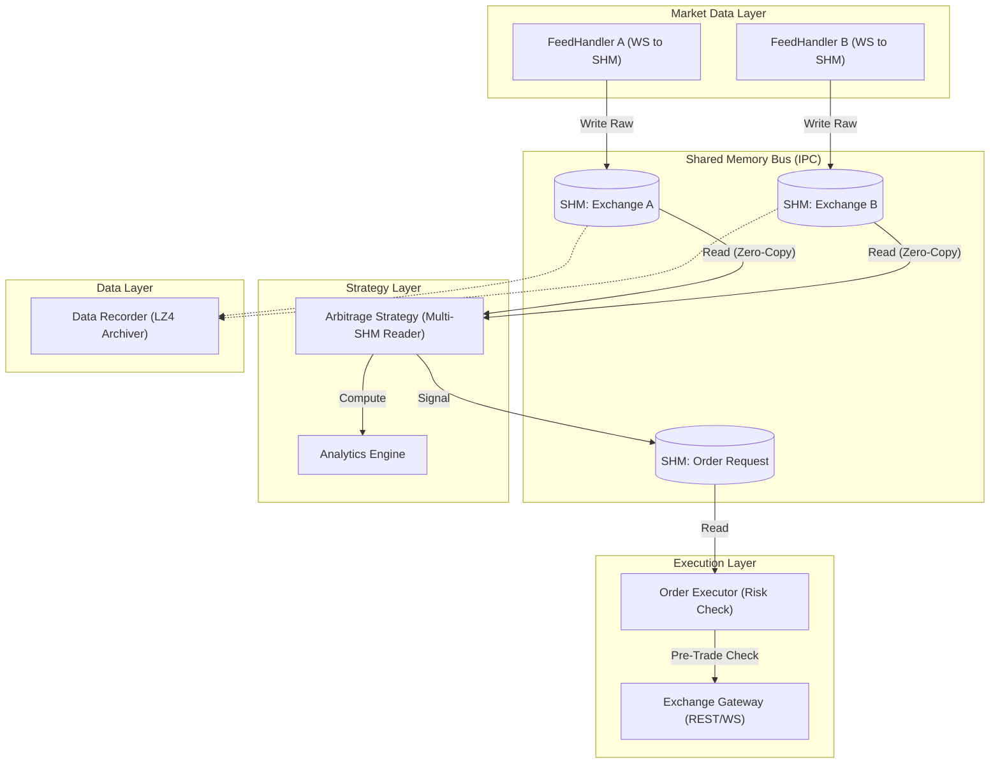

# HftSystem: C++20 Low Latency Proprietary Trading Engine
#### High-Performance Trading System featuring Shared Memory IPC & Lock-free Architecture

## 1. Project Overview (개요)
**HftSystem**은 **Boost.Interprocess** 기반의 **Zero-Copy Shared Memory** 아키텍처를 적용한 C++ 고빈도 매매(HFT) 엔진입니다.

데이터 수집(Feed), 시장 분석(Analytics), 전략 실행(Strategy), 주문 집행(Execution)을 독립된 프로세스로 분리하여 **마이크로초($\mu s$) 단위의 처리 속도**와 **프로세스 간 장애 격리(Fault Isolation)**를 구현했습니다.

---

## 2. Key Features (핵심 기능)
*   🚀 **Low Latency IPC:** 커널 개입 없는 **Zero-Copy** 방식과 자체 구현한 **Lock-free RingBuffer**를 통해 프로세스 간 통신 지연을 **40ns** 수준으로 최적화.
*   🛡️ **Financial Integrity:** 부동소수점 오차를 원천 차단하기 위해 **256비트 정수(`int256_t`)** 기반의 **`FinancialDecimal`** 타입과 **Strong Typing** 시스템 적용.
*   🧠 **Decoupled Analytics:** 데이터 피드의 연산 부하를 제거하고, 전략 프로세스 내 **`AnalyticsEngine`**에서 지표(OFI, VPIN)를 필요시 계산(On-Demand).
*   🌐 **Multi-Exchange Arbitrage:** 단일 전략 프로세스가 다수 거래소(Exchange A, B)의 공유 메모리에 동시 접속하여 **실시간 시세 괴리 포착**.
*   🧩 **Flexible Configuration:** `StrategyFactory` 패턴과 JSON 설정을 적용하여, 재컴파일 없이 전략 파라미터 튜닝 가능.

---

## 3. System Architecture (아키텍처)

이벤트 기반의 멀티 프로세스 구조로, 각 모듈은 공유 메모리(Shared Memory)를 데이터 버스(Data Bus)로 사용합니다.

### 3.1. Core Components
| Component | Role & Responsibility | Tech Stack |
| :--- | :--- | :--- |
| **FeedHandler** | 거래소 시세 수신, 정합성 검증(Validator), 정규화 | Boost.Beast (WS), OrderBook Reconstruction |
| **StrategyRunner** | 다중 거래소 데이터 수신, 알파 시그널 계산, 주문 생성 | Multi-SHM Binding, Analytics Engine |
| **OrderExecutor** | 주문 요청 수신, 사전 리스크 통제, API 전송, 체결 관리 | In-line Risk Engine, Generic Gateway |
| **DataRecorder** | 틱 데이터 고속 로깅 (손실 압축 없음) | LZ4 Compression, Async I/O, Retry Logic |

---

## 4. Technical Details (기술 상세)

### A. Data Integrity (데이터 무결성)
금융 시스템의 정밀도를 위해 `double` 자료형 사용을 배제했습니다.
*   **Implementation:** `int256_t` 기반의 고정 소수점 타입 **`FinancialDecimal`** 구현.
*   **Strong Typing:** `Price`, `Quantity`, `Amount`를 서로 다른 타입으로 정의하여, '가격 + 수량' 같은 논리적 오류를 컴파일 타임에 방지.

### B. Optimized Memory Layout (메모리 최적화)
*   **POD (Plain Old Data):** 공유 메모리에 저장되는 모든 구조체는 `#pragma pack(1)`을 적용하여 패딩(Padding)을 제거하고 캐시 효율성(Cache Locality)을 높였습니다.
*   **Lock-free RingBuffer:** Mutex(Lock)를 사용하지 않고 `std::atomic`과 `memory_order_acquire/release`를 활용한 SPSC 큐를 구현하여 스레드 경합(Contention)을 제거했습니다.

### C. Risk Management System (RMS)
주문 안정성을 위해 `OrderExecutor` 내부에 리스크 엔진을 내재화(In-line)하였습니다.
*   **Max Notional Check:** 주문 전송 직전(<1µs), `Price * Quantity`가 설정된 한도를 초과하는지 검증.
*   **Fat-finger Protection:** 비정상적인 가격 괴리나 수량 입력을 차단하여 운영 실수 방지.

### D. Extensibility (확장성)
*   **Factory Pattern:** `StrategyFactory`를 통해 설정 파일(JSON)의 ID만으로 전략 객체를 런타임에 동적으로 생성.
*   **Config-Driven:** 전략 로직(Code)과 설정(Data)을 분리하여, 재컴파일 없이 파라미터 수정 가능.

---

## 5. Development Environment
*   **OS:** Linux (Ubuntu 22.04 LTS recommended)
*   **Compiler:** GCC 11+ or Clang 14+ (C++20 Support)
*   **Build System:** CMake 3.20+
*   **Dependencies:** Boost 1.78+, OpenSSL, LZ4, Apache Arrow/Parquet, nlohmann/json, spdlog, fmt

---

## 6. Future Roadmap
*   **Real-time Dashboard (TUI):** `market_snapshot` 툴을 고도화하여, 터미널 환경에서 호가 스프레드, 체결 내역, 실시간 PnL을 시각화하는 **ncurses 기반 TUI(Text User Interface)** 개발.
*   **Remote Alert System:** 텔레그램(Telegram) API를 연동하여 주문 체결, 프로세스 비정상 종료, 에러 발생 시 운영자에게 즉시 푸시 알림을 전송하는 **24/7 관제 시스템** 구축.
*   **Global Kill Switch:** 시장 급변이나 로직 오류 감지 시, 단일 명령으로 모든 프로세스를 동결하고 미체결 주문을 일괄 취소하는 **비상 제동 장치(Emergency Stop)** 구현.
*   **Optimization:** `simdjson` 도입을 통한 JSON 파싱 가속 및 `TCP_NODELAY` 튜닝을 통해 Tick-to-Trade 레이턴시 추가 단축.
