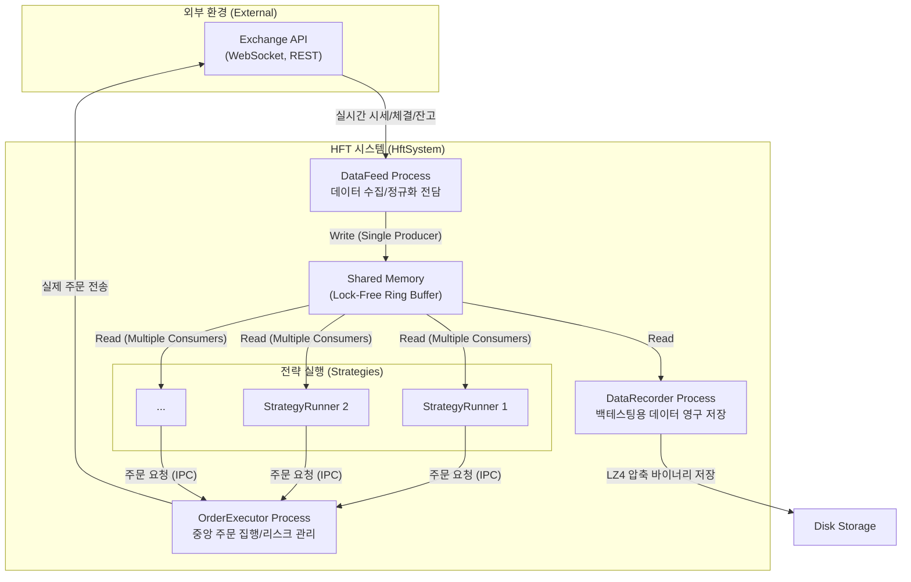
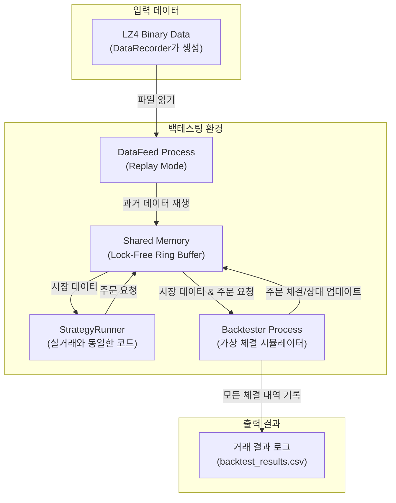

# HftSystem: C++ 기반 고성능 고빈도 거래(HFT) 시스템
#### (An Institutional-Grade High-Frequency Trading System in C++)

## I. 프로젝트 비전 및 목표 (Vision & Goals)
본 프로젝트는 Node.js와 같은 환경에서 발생하는 기술적 한계(예: GC Pause)를 근본적으로 해결하고, 기관 수준의 안정성과 마이크로초(μs) 단위의 예측 가능한 성능을 갖춘 초저지연 HFT 시스템을 C++17 표준으로 구축하는 것을 목표로 합니다.

#### 핵심 목표:
1.  **견고함과 안정성 (Robustness & Stability)**: 자산 보호를 최우선으로, 예측 불가능한 상황에서도 안정적으로 동작하는 시스템을 구축합니다.
2.  **초저지연 성능 (Ultra-Low Latency)**: 데이터 수신부터 주문 실행까지의 전 과정에서 지연을 최소화하여 마이크로초(μs) 단위의 반응 속도를 추구합니다.
3.  **높은 확장성 (High Scalability & Modularity)**: 새로운 거래소, 데이터 소스, 거래 전략을 레고 블록처럼 쉽게 교체하고 확장할 수 있는 유연한 아키텍처를 지향합니다.
4.  **완벽한 재현성 (100% Reproducibility)**: 실거래에 사용되는 코드를 단 한 줄도 변경하지 않고 과거 데이터로 시뮬레이션(백테스팅)하여 전략을 검증할 수 있어야 합니다.

## II. 시스템 아키텍처 (System Architecture)
HftSystem은 **역할이 명확하게 분리된 다중 프로세스(Multi-Process)**가 **공유 메모리(Shared Memory)**를 통해 데이터를 전달하는 파이프라인 구조를 채택했습니다. 이 구조는 장애 격리(Fault Isolation)를 극대화하고 시스템의 안정성을 보장하는 핵심 골격입니다.



- **DataFeed Process**: 거래소 API로부터 모든 외부 데이터를 수신하고, 시스템 내부 표준 포맷으로 정규화하여 공유 메모리에 쓰는 **유일한 생산자(Producer)**입니다.
- **StrategyRunner Process**: 공유 메모리로부터 시장 데이터를 **읽기 전용(Read-Only)**으로 소비하여 거래 시그널을 생성하고, '주문 요청'을 `OrderExecutor`에게 보냅니다.
- **OrderExecutor Process**: 모든 주문 요청을 중앙에서 처리하는 **싱글턴 프로세스**입니다. 주문 전 리스크 검증, 가용 잔고 확인 후 실제 주문을 거래소로 전송합니다.
- **DataRecorder Process**: 백테스팅을 위해 공유 메모리의 모든 데이터를 LZ4 압축 바이너리 형식으로 디스크에 기록합니다.

## III. 핵심 설계 결정 (Key Design Decisions)

### A. 멀티-프로세스 아키텍처 (Multi-Process Architecture)
- **목적**: **장애 격리(Fault Isolation)** 및 **무중단 운영(Zero-Downtime)** 의 기반 마련.
- **구현**: 데이터 수집(`datafeed`), 전략 실행(`strategy_runner`), 주문 집행(`order_executor`)을 물리적으로 분리했습니다. 특정 전략 로직의 버그로 `strategy_runner`가 비정상 종료되더라도, 데이터 수집과 다른 핵심 프로세스들은 전혀 영향을 받지 않아 시스템 전체의 안정성을 유지할 수 있습니다.

### B. 초저지연 IPC: 공유 메모리 & 링 버퍼 (Ultra-Low Latency IPC: Shared Memory & Ring Buffer)
- **목적**: 커널 개입(Context Switching) 및 데이터 복사 오버헤드를 원천적으로 제거하여 최고 속도의 통신을 구현합니다.
- **구현**: `Boost.Interprocess`를 활용한 **공유 메모리**와 CPU 캐시에 친화적인 **락프리(Lock-Free) 링 버퍼**를 통해 데이터를 전달합니다. 이 설계는 시스템의 성능을 나노초 단위로 끌어올리는 핵심 기술입니다. **(자세한 성능은 VIII. 주요 성과 참조)**

### C. 데이터 무결성을 위한 타입 시스템 및 직렬화 (Type System & Serialization for Data Integrity)
- **목적**: 부동소수점 오류를 원천 차단하고, 프로세스 간 데이터 전달의 안정성을 100% 보장합니다.
- **구현**: 모든 금융 데이터(가격, 수량)는 `double` 대신 `Boost.Multiprecision` 기반의 고정소수점 클래스 **`FinancialDecimal`**을 사용합니다. 프로세스 간 통신에는 C-스타일 **POD 타입**과 안전성이 검증된 **문자열 기반 직렬화** 방식을 채택하여 메모리 오염 가능성을 원천적으로 제거했습니다.

### D. 완벽한 재현성을 위한 백테스팅 (Backtesting for 100% Reproducibility)
- **목적**: 실거래 코드를 100% 동일하게 사용하여 과거 데이터로 전략의 성과를 검증합니다.
- **구현**: `DataFeed`는 `IExchangeGateway` 인터페이스를 통해 실거래 API 대신 로컬 바이너리 파일을 재생하는 `ReplayGateway`로 교체됩니다. 이 과정에서 `StrategyRunner`를 포함한 모든 하위 모듈의 코드는 단 한 줄도 수정되지 않아 시뮬레이션과 실제 거래 간의 논리적 불일치 가능성을 제거합니다.

### E. 느슨한 결합을 위한 인터페이스 기반 설계 (Interface-based Design for Loose Coupling)
- **목적**: 새로운 거래소, 전략, 데이터 포맷 등을 기존 코드에 미치는 영향을 최소화하며 유연하게 확장합니다.
- **구현**: `IExchangeGateway`, `IStrategy` 등 시스템의 주요 컴포넌트는 모두 추상 인터페이스 기반으로 설계되었습니다. 팩토리 패턴과 결합하여, 새로운 기능을 추가하는 작업은 해당 인터페이스의 구현체를 새로 작성하고 등록하는 것으로 단순화됩니다.

## IV. 디렉터리 구조 (Directory Structure)
```
hftsystem/
├── api/                        # 거래소 API 클라이언트 모듈
├── common/                     # 공통 유틸리티 (금융 타입, 데이터 구조)
├── config/                     # 시스템 및 전략 설정 파일 (JSON)
├── data/                       # 백테스팅 및 분석용 데이터 저장소
├── data_store/                 # 공유 메모리 IPC 및 데이터 저장소 구현
├── gateways/                   # 데이터 소스 추상화 게이트웨이
├── interfaces/                 # 최상위 추상 인터페이스 (IExchangeGateway 등)
├── managers/                   # 핵심 비즈니스 로직 관리 모듈
├── processes/                  # 독립 실행 파일 (main) 소스 코드
├── strategies/                 # 개별 거래 전략 구현 코드
├── strategy_engine/            # 전략 실행 엔진 코어 로직
├── tests/                      # 단위/통합 테스트 코드 (GTest)
├── tools/                      # 데이터 변환/분석용 보조 도구
├── utils/                      # 기타 보조 유틸리티
├── build/                      # 빌드 산출물
└── README.md                   # ...
```

## V. 백테스팅 워크플로우 (Backtesting Workflow)
본 시스템의 백테스팅은 **'실거래 코드 변경 제로'** 원칙을 기반으로, 실시간 환경의 컴포넌트를 백테스팅용 컴포넌트로 교체하는 방식으로 동작합니다. 이를 통해 전략 코드의 100% 재현성을 보장합니다.



## VI. 기술 스택 (Technology Stack)
- **Language**: C++17
- **Key Libraries**: Boost (Interprocess, Beast), spdlog, fmt, cURL, nlohmann-json, LZ4
- **Core Concepts**: Multi-Process Architecture, Shared Memory IPC, Lock-Free Data Structures, Asynchronous I/O
- **Build System**: CMake with vcpkg
- **Testing & Quality**: Google Test (GTest) for Unit/Integration Testing, Clang-Tidy for Static Analysis
- **Operating System**: Linux (Ubuntu)

## VIII. 주요 성과 및 품질 보증 (Key Achievements & Quality Assurance)
본 시스템은 설계 목표를 달성하기 위해 다음과 같은 구체적인 성과와 품질 보증 체계를 갖추었습니다.

#### A. 정량적 성능 지표 (Quantitative Performance Metrics)
- **IPC Latency**: 공유 메모리 링 버퍼의 성능 스트레스 테스트 결과, 400만 건의 메시지 전송에 159ms가 소요되어, 메시지당 평균 **약 40 나노초(ns)** 수준의 초저지연 통신을 달성했습니다.
- **IPC Throughput**: 단일 생산자-소비자 채널에서 초당 **약 2,500만 건**의 이벤트를 처리할 수 있는 높은 처리량을 보입니다. 이는 CPU 캐시 효율을 극대화한 설계의 결과입니다.

#### B. 데이터 무결성 및 시스템 안정성 (Data Integrity & System Stability)
- **Financial Data Accuracy**: `Boost.Multiprecision` 기반의 `FinancialDecimal` 타입을 자체 구현하여, 모든 금융 계산에서 부동소수점 오류를 원천적으로 배제하고 데이터의 완전한 무결성을 보장합니다.
- **Long-Term Stability**: WebSocket 연결 유실 시 발생할 수 있는 데이터 오염을 방지하기 위해, 주기적으로 REST API를 통해 전체 오더북 스냅샷을 요청하여 로컬 상태를 보정하는 기능을 구현했습니다.

#### C. 코드 품질 보증 체계 (Code Quality Assurance)
- **Test-Driven Development**: `GTest` 프레임워크를 기반으로 핵심 로직(IPC 채널, 금융 타입 연산 등)에 대한 단위 테스트 및 통합 테스트를 작성하여 코드의 정확성과 안정성을 검증합니다.
- **Static Analysis**: `Clang-Tidy`를 빌드 시스템에 통합하여, 잠재적인 버그, 메모리 누수, 안티 패턴 등을 컴파일 시점에 자동으로 검출하고 일관된 코딩 스타일을 유지합니다.

## IX. 발전 방향 및 로드맵 (Future Direction & Roadmap)

#### A. 코어 아키텍처 (Core Architecture)
- **동적 전략 로딩 (Dynamic Strategy Loading)**: 현재의 정적 컴파일 방식에서 나아가, 시스템 중단 없이 실시간으로 전략을 추가/제거/업데이트할 수 있는 플러그인 아키텍처를 구현합니다. 공유 라이브러리(`.so/.dll`) 기반으로 설계하며, C-style ABI 래퍼를 통해 C++ ABI 안정성 문제를 해결하는 것을 목표로 합니다.

#### B. 데이터 영속성 및 분석 (Data Persistence & Analysis)
- **PostgreSQL/TimescaleDB**: 실시간 데이터 단기 저장 및 모니터링 대시보드 연동.
- **HDF5**: 장기 데이터 영구 보관(Archiving) 및 머신러닝 연구용 데이터셋 구축.

#### C. DevOps 및 도구 (DevOps & Tooling)
- **모니터링 (Monitoring)**: `htop`과 같이 터미널에서 시스템 상태(프로세스, PnL)를 실시간으로 확인할 수 있는 TUI(Terminal UI) 도구 및 웹 기반 대시보드를 개발합니다.
- **CI/CD**: `GTest`와 `Clang-Tidy`를 포함한 자동화된 빌드/테스트 파이프라인을 구축합니다.
- **컨테이너화 (Containerization)**: `Docker`를 사용하여 개발 및 배포 환경을 컨테이너화하여 일관성을 확보합니다.
