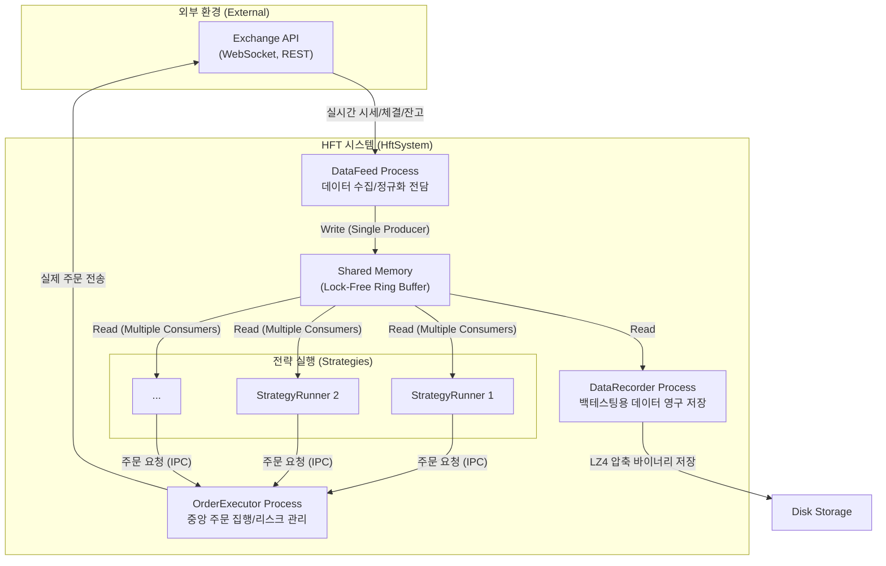
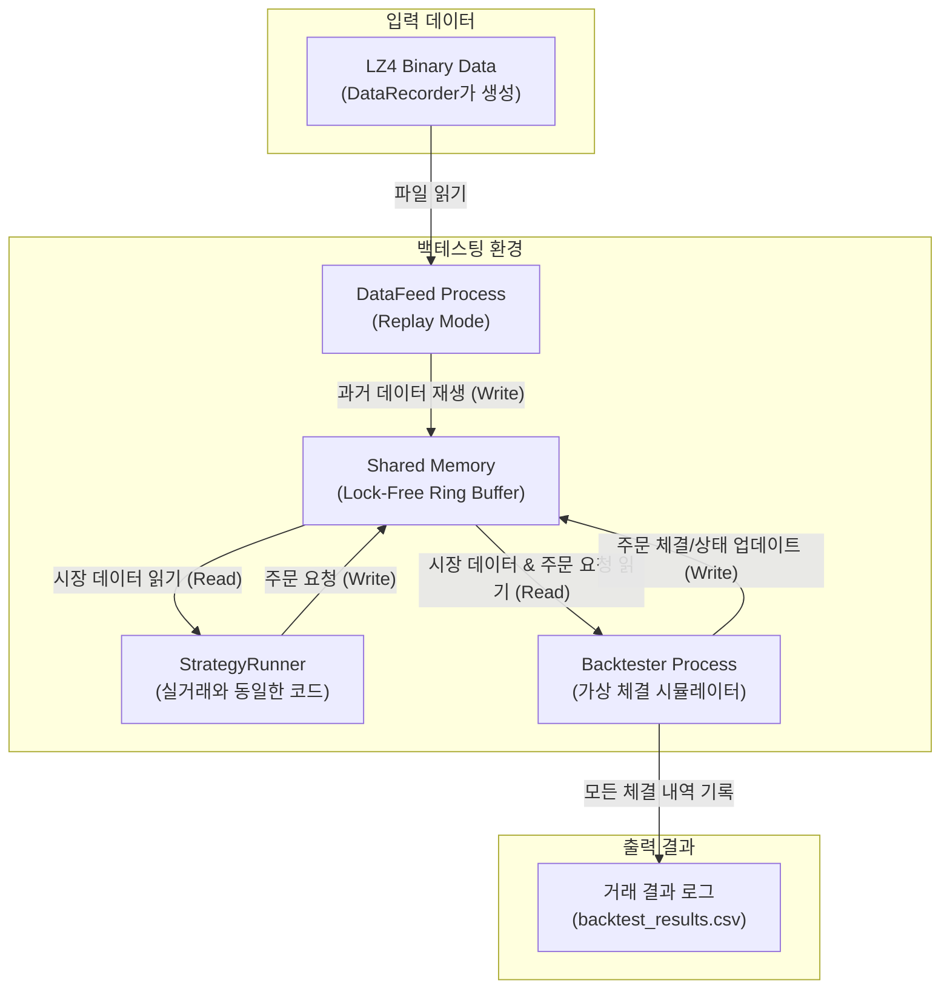

# HftSystem: C++ 기반 고성능 고빈도 거래(HFT) 시스템
#### (An Institutional-Grade High-Frequency Trading System in C++)

## I. 프로젝트 비전 및 목표 (Vision & Goals)
본 프로젝트는 Node.js와 같은 환경에서 발생하는 기술적 한계(예: GC Pause)를 근본적으로 해결하고, 기관 수준의 안정성과 마이크로초(μs) 단위의 예측 가능한 성능을 갖춘 초저지연 HFT 시스템을 C++17 표준으로 구축하는 것을 목표로 합니다.

#### 핵심 목표:
1.  **견고함과 안정성 (Robustness & Stability)**: 자산 보호를 최우선으로, 예측 불가능한 상황에서도 안정적으로 동작하는 시스템을 구축합니다.
2.  **초저지연 성능 (Ultra-Low Latency)**: 데이터 수신부터 주문 실행까지의 전 과정에서 지연을 최소화하여 마이크로초(μs) 단위의 반응 속도를 추구합니다.
3.  **높은 확장성 (High Scalability & Modularity)**: 새로운 거래소, 데이터 소스, 거래 전략을 레고 블록처럼 쉽게 교체하고 확장할 수 있는 유연한 아키텍처를 지향합니다.
4.  **완벽한 재현성 (100% Reproducibility)**: 실거래에 사용되는 코드를 단 한 줄도 변경하지 않고 과거 데이터로 시뮬레이션(백테스팅)하여 전략을 검증할 수 있어야 합니다.

## II. 시스템 아키텍처 (System Architecture)
HftSystem은 **역할이 명확하게 분리된 다중 프로세스(Multi-Process)**가 **공유 메모리(Shared Memory)**를 통해 데이터를 전달하는 파이프라인 구조를 채택했습니다. 이 구조는 장애 격리(Fault Isolation)를 극대화하고 시스템의 안정성을 보장하는 핵심 골격입니다.



- **DataFeed Process**: 거래소 API로부터 모든 외부 데이터를 수신하고, 시스템 내부 표준 포맷으로 정규화하여 공유 메모리에 쓰는 **유일한 생산자(Producer)**입니다.
- **StrategyRunner Process**: 공유 메모리로부터 시장 데이터를 **읽기 전용(Read-Only)**으로 소비하여 거래 시그널을 생성하고, '주문 요청'을 `OrderExecutor`에게 보냅니다.
- **OrderExecutor Process**: 모든 주문 요청을 중앙에서 처리하는 **싱글턴 프로세스**입니다. 주문 전 리스크 검증, 가용 잔고 확인 후 실제 주문을 거래소로 전송합니다.
- **DataRecorder Process**: 백테스팅을 위해 공유 메모리의 모든 데이터를 LZ4 압축 바이너리 형식으로 디스크에 기록합니다.

## III. 핵심 설계 결정 (Key Design Decisions)

### A. 멀티-프로세스 아키텍처 (Multi-Process Architecture)
- **목적**: **장애 격리(Fault Isolation)** 및 **무중단 배포(Zero-Downtime Deployment)**
- **구현**: 데이터 수집(`datafeed`), 전략 실행(`strategy_runner`), 주문 집행(`order_executor`)을 물리적으로 분리했습니다. 특정 전략 로직에 버그가 발생하여 프로세스가 중단되더라도, 데이터 수집과 주문 집행 기능은 전혀 영향을 받지 않아 시스템 전체의 안정성을 유지할 수 있습니다.

### B. 초저지연 IPC: 공유 메모리 & 링 버퍼 (Ultra-Low Latency IPC: Shared Memory & Ring Buffer)
- **목적**: 프로세스 간 데이터 복사 오버헤드를 원천적으로 제거하여 최고 속도의 통신을 구현합니다.
- **구현**: `Boost.Interprocess`를 활용한 **공유 메모리**를 통해 여러 프로세스가 동일한 메모리 영역에 직접 접근합니다. 데이터 스트림은 **락프리(Lock-Free) 링 버퍼**를 통해 전달되어, Mutex와 같은 동기화 오버헤드 없이 안전하고 빠른 데이터 공유를 보장합니다.

### C. POD 타입 전용 데이터 직렬화 (POD-only Data Serialization)
- **목적**: 프로세스 간 ABI(Application Binary Interface) 호환성 문제를 방지하고 메모리 레이아웃을 예측 가능하게 유지합니다.
- **구현**: 공유 메모리에 저장되는 모든 데이터 구조체는 `std::vector`, `std::string`과 같은 동적 컨테이너를 배제하고, C-스타일 고정 크기 배열과 `char[]`로만 구성된 **순수 POD(Plain Old Data) 타입**으로 정의합니다.

### D. 완벽한 재현성을 위한 백테스팅 (Backtesting for 100% Reproducibility)
- **목적**: 실거래 코드를 100% 동일하게 사용하여 과거 데이터로 전략의 성과를 검증합니다.
- **구현**: `datafeed`는 실거래 API와 통신하는 `ExchangeGateway` 대신, `data_recorder`가 저장한 바이너리 파일을 재생하는 `ReplayGateway`를 사용합니다. `order_executor`는 실제 주문을 내는 대신 가상 체결을 시뮬레이션하는 `backtester` 프로세스로 교체됩니다. 이 과정에서 `strategy_runner`의 코드는 단 한 줄도 수정되지 않습니다.

### E. 느슨한 결합을 위한 인터페이스 기반 설계 (Interface-based Design for Loose Coupling)
- **목적**: 새로운 거래소나 모듈을 추가할 때 기존 코드에 미치는 영향을 최소화합니다.
- **구현**: `ApiClient`, `Gateway` 등 외부와 상호작용하는 모든 컴포넌트는 추상 인터페이스(pure virtual class)를 기반으로 설계되었습니다. 새로운 거래소를 추가하는 작업은 해당 인터페이스의 구현체를 새로 작성하는 것으로 단순화됩니다.

## IV. 디렉터리 구조 (Directory Structure)
```
hftsystem/
├── api/                        # 거래소 API 클라이언트 모듈
│   ├── common/
│   │   └── interfaces/         # API 추상 인터페이스 (IRestApiClient 등)
│   └── exchanges/
│       └── (exchange_name)/    # 거래소별 API 구현체 (bithumb, upbit 등)
├── common/                     # 공통 유틸리티 (로깅, 데이터 구조, 에러 처리)
├── config/                     # 시스템 및 전략 설정 파일 (JSON, YAML)
│   ├── exchanges/              # 거래소별 설정
│   ├── order_rules/            # 주문 규칙 설정
│   ├── strategies/             # 전략 파라미터 설정
│   └── tick_rules/             # 틱 데이터 규칙 설정
├── data/                       # 백테스팅 및 분석용 데이터 저장소
├── data_store/                 # 인메모리 데이터 저장소 (공유 메모리 IPC 구현)
├── execution_engine/           # 주문 실행 엔진 코어 로직
├── gateways/                   # 데이터 소스 추상화 게이트웨이 (ExchangeGateway 등)
├── interfaces/                 # 최상위 추상 인터페이스 (IGateway 등)
├── logs/                       # 실행 로그 저장소
├── managers/                   # 핵심 비즈니스 로직 관리 모듈
│   ├── account_manager/        # 계좌 및 잔고 관리
│   ├── configuration_manager/  # 설정 로딩 및 관리
│   ├── order_book_manager/     # 호가창 상태 관리
│   ├── order_manager/          # 주문 상태 및 라이프사이클 관리
│   ├── risk_manager/           # 주문 전 리스크 검증
│   └── trade_manager/          # 체결 및 포지션 관리
├── processes/                  # 독립 실행 파일 (main) 소스 코드
│   ├── backtester/             # 백테스팅 주문 체결기 프로세스
│   ├── data_recorder/          # 데이터 기록 프로세스
│   ├── datafeed/               # 데이터 수집 프로세스
│   ├── order_executor/         # 주문 집행 프로세스
│   └── strategy_runner/        # 전략 실행기 프로세스
├── scripts/                    # 자동화 스크립트 (빌드, 실행, 배포)
├── state/                      # 전략 상태 영구 저장소 (예정)
├── strategies/                 # 개별 거래 전략 구현 코드
├── strategy_engine/            # 전략 실행 엔진 코어 로직
│   ├── interfaces/             # 전략 로직 추상 인터페이스 (IStrategy)
│   └── src/                    # 엔진 구현부
├── tests/                      # 단위/통합 테스트 코드
├── utils/                      # 기타 보조 유틸리티
├── build/                      # 빌드 산출물 (바이너리, 라이버리)
├── .env                        # 환경 변수 (API 키 등 민감 정보)
└── README.md                   # 프로젝트 문서
```

## V. 백테스팅 워크플로우 (Backtesting Workflow)
본 시스템의 백테스팅은 **'실거래 코드 변경 제로'** 원칙을 기반으로, 실시간 환경의 컴포넌트를 백테스팅용 컴포넌트로 교체하는 방식으로 동작합니다. 이를 통해 전략 코드의 100% 재현성을 보장합니다.

- **`DataFeed Process`**: 실시간 API와 통신하는 대신, 저장된 바이너리 파일을 읽는 **리플레이(Replay) 모드**로 실행됩니다.
- **`OrderExecutor Process`**: 실제 주문을 내는 대신, 가상 체결을 시뮬레이션하는 **`Backtester Process`**로 대체됩니다.



#### 단계별 실행 흐름:
1.  **데이터 재생**: `DataFeed` 프로세스가 `ReplayGateway`를 통해 `DataRecorder`가 생성한 `.bin.lz4` 파일을 읽습니다. 과거 시장 데이터를 타임스탬프에 맞춰 공유 메모리에 순서대로 '재생'합니다.
2.  **전략 실행**: `StrategyRunner`는 실거래 환경과 100% 동일하게 동작합니다. 데이터가 라이브 API에서 오는지, 파일에서 오는지 전혀 인지하지 못한 채, 공유 메모리의 데이터를 읽고 거래 결정을 내립니다.
3.  **가상 체결**: `Backtester` 프로세스는 `OrderExecutor`를 대체합니다. 공유 메모리에서 `StrategyRunner`가 보낸 주문 요청을 읽고, 동시에 재생되는 시장 데이터(호가창 등)와 비교하여 체결을 시뮬레이션합니다.
4.  **상태 업데이트 및 기록**: `Backtester`는 가상 체결 결과를 다시 공유 메모리에 써서 `StrategyRunner`가 자신의 주문 상태를 추적할 수 있도록 합니다. 동시에, 모든 체결 내역(시간, 가격, 수량, 수수료 등)을 분석하기 쉽도록 `.csv` 파일에 상세히 기록합니다.
5.  **성과 분석**: 백테스팅 종료 후, 생성된 `.csv` 파일을 Python(Pandas) 등의 도구로 분석하여 전략의 PnL, MDD, 승률과 같은 핵심 성과 지표를 평가합니다.

## VI. 기술 스택 (Technology Stack)
- **Language**: C++17
- **Key Libraries**: Boost (Interprocess, Beast), cURL, nlohmann-json, LZ4
- **Core Concepts**: Multi-Process Architecture, Shared Memory IPC, Lock-Free Data Structures, Asynchronous I/O
- **Build System**: CMake with vcpkg (모든 의존성 통일)
- **Operating System**: Linux (Ubuntu)

## VII. 향후 개발 로드맵 (Planned Features)
- **Database**:
  - **PostgreSQL/TimescaleDB**: 실시간 데이터 단기 저장 및 모니터링 대시보드 연동.
  - **HDF5**: 장기 데이터 영구 보관(Archiving) 및 복잡한 데이터 분석/ML 연구용 데이터셋 구축.
- **Monitoring**:
  - **Terminal UI (TUI)**: `htop`과 같이 터미널에서 시스템 상태(프로세스, PnL)를 실시간으로 확인할 수 있는 경량 모니터링 도구.
  - **Web-based Dashboard**: 차트 등을 활용한 풍부한 시각화 분석 대시보드.
- **CI/CD**:
  - **Docker**: 개발 및 배포 환경을 컨테이너화하여 일관성 확보.
