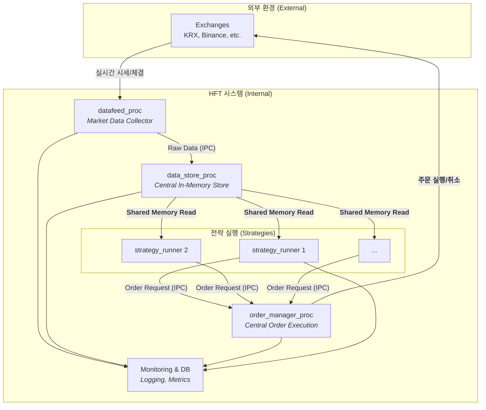

# C++ 기반 고성능 HFT 시스템 아키텍처 설계
#### (High-Frequency Trading System Architecture Design)

## 1. 프로젝트 개요 (Overview)
본 프로젝트는 실무에서 경험한 HFT 시스템의 기술적 한계(예: Node.js의 GC로 인한 지연, CPU 집약적 작업의 병목)를 극복하고, 장내파생상품과 같은 초저지연 거래 환경에 최적화된 시스템을 구축하는 것을 목표로 합니다.

### 핵심 목표:
- **초저지연 (Ultra-low Latency)**: 마이크로초(μs) 단위의 반응 속도 구현
- **무중단 운영 (High Availability)**: 개별 컴포넌트의 장애가 전체 시스템에 영향을 주지 않는 안정성 확보
- **확장성 (Scalability)**: 새로운 거래소 및 전략의 용이한 추가

## 2. 핵심 아키텍처 (Core Architecture)
본 시스템은 안정성과 성능을 극대화하기 위해 **멀티-프로세스(Multi-Process)** 구조를 채택했습니다. 각 핵심 기능은 독립된 프로세스로 실행되어 서로의 작업에 영향을 주지 않습니다.



- **Datafeed Process**: 거래소로부터 실시간 시세/체결 데이터를 수신하는 역할만 전담합니다.
- **Data Store Process**: 수신된 데이터를 중앙 인메모리 저장소(공유 메모리)에 기록합니다. 모든 전략은 이 중앙 저장소의 데이터를 참조합니다.
- **Strategy Runner Process(es)**: 각 거래 전략은 개별 프로세스로 실행됩니다. 이를 통해 특정 전략의 오류나 로직 수정으로 인한 재시작이 다른 전략이나 데이터 수집 프로세스에 전혀 영향을 미치지 않습니다.


## 3. 주요 설계 결정 (Key Design Decisions)

### A. 멀티-프로세스 구조 (Multi-Process Architecture)
- **목적**: **장애 격리(Fault Isolation)** 및 **무중단 배포(Zero-Downtime Deployment)**
- **구현**: 데이터 수집, 저장, 전략 실행을 완전히 분리했습니다. 이를 통해 특정 전략 로직에 버그가 발생하거나 업데이트가 필요할 경우, 해당 Strategy Runner 프로세스만 재시작하면 되므로 전체 시스템의 중단이 발생하지 않습니다.
  
### B. 프로세스 간 통신 (IPC - Inter-Process Communication)
- **문제**: 다수의 전략 프로세스가 동일한 시장 데이터에 접근할 때 발생하는 데이터 복사 오버헤드와 지연을 최소화해야 합니다.
해결책:
- **공유 메모리 (Shared Memory)**: 데이터를 프로세스 간에 복사할 필요 없이 직접 접근할 수 있어 가장 빠른 데이터 공유가 가능합니다. Data Store가 공유 메모리에 시장 데이터를 쓰면, 모든 Strategy Runner가 즉시 해당 데이터를 읽을 수 있습니다.
- **락프리 링버퍼 (Lock-free Ring Buffer)**: 공유 메모리 내에서 생산자(Data Store)와 소비자(Strategy Runner) 간의 경합을 최소화하고, Lock 없이 안전하게 데이터를 주고받기 위해 적용했습니다. 이는 Mutex 등 Lock 기반 동기화 방식에서 발생하는 오버헤드를 제거하여 지연 시간을 줄이는 데 결정적인 역할을 합니다.
  
### C. 확장성을 고려한 모듈화 설계 (Modular & Scalable Design)
- **managers**: 주문, 계좌, 리스크 관리 등 핵심 비즈니스 로직을 독립된 라이브러리/컴포넌트로 분리하여 재사용성과 유지보수성을 높였습니다.
- **api**: 거래소 연동 모듈을 인터페이스 기반으로 추상화했습니다. 새로운 거래소(예: 한국거래소)를 추가해야 할 경우, 정의된 인터페이스에 맞춰 구현체만 추가하면 되므로 시스템의 다른 부분에 영향을 주지 않고 쉽게 확장할 수 있습니다.

  
## 4. 디렉터리 구조 (Directory Structure)

```
projects/hftsystem
├── common/                     # 공통 유틸리티 (로깅, 에러 처리, 데이터 구조, 공용 헬퍼 함수)
│   └── CMakeLists.txt
│
├── api/                        # 거래소 API 클라이언트 모듈
│   ├── common/
│   │   └── interfaces/         # API 인터페이스 정의
│   │       ├── i_rest_api_private_client.hpp 
│   │       ├── i_rest_api_public_client.hpp 
│   │       ├── i_websocket_private_client.hpp
│   │       └── i_websocket_public_client.hpp
│   └── exchanges/              # 거래소별 API 구현체를 폴더 단위로 구분 (예: Bithumb, Upbit, Binance, KRX 등)
│       ├── exchanges_rest_api_private_client.cpp
│       ├── exchanges_rest_api_public_client.cpp
│       ├── exchanges_websocket_private_client.cpp
│       ├── exchanges_websocket_public_client.cpp
│       └── CMakeLists.txt
│
├── config/                     # 설정 파일 (환경변수, 설정 JSON 등)
│
├── managers/                   # 핵심 관리 모듈 (Core Managers)
│   ├── account_manager/        # 계좌 및 잔고 관리
│   ├── configuration_manager/  # 설정값 로딩 및 관리
│   ├── order_book_manager/     # 오더북 관리 (시세 데이터 구조화)
│   ├── order_manager/          # 주문 생성/취소/체결 관리
│   ├── trade_manager/          # 체결 내역 및 포지션 관리
│   └── risk_manager/           # 리스크 제어 (슬리피지, 포지션 한도, 증거금 체크 등)
│
├── data_store/                 # 중앙 인메모리 데이터 저장소 모듈 (단일 데이터 소스, IPC 또는 공유 메모리)
│
├── data_feeds/                 # 거래소 데이터 수집 모듈
│   ├── market_data_handler.cpp # 시세 데이터(WebSocket) 핸들러
│   └── private_data_handler.cpp# 개인 데이터(잔고/체결/포지션) 핸들러
│
├── strategy_engine/            # 전략 실행 엔진
│   ├── interfaces/             # 전략 인터페이스 정의
│   ├── src/                    # 실제 전략 구현
│   └── CMakeLists.txt
│
├── monitoring/                 # 모니터링 (로깅, 메트릭, 알림, 대시보드)
│
├── database/                   # 데이터베이스 연동 (Postgres, InfluxDB, Redis 등)
│
├── processes/                  # 독립 실행 프로세스 단위
│   ├── datafeed/               # 실시간 데이터 피드 프로세스
│   ├── datastore/              # 중앙 데이터 저장 프로세스 (필요 시, 인메모리 DB/IPC)
│   └── strategy_runner/        # 전략 실행 프로세스 (전략별 독립 실행)
│
├── backtesting_engine/         # 백테스팅/리플레이 엔진
│   ├── src/                    # 백테스팅 코어 로직
│   ├── data/                   # 시세/체결 데이터 저장
│   ├── strategies/             # 백테스팅용 전략 구현
│   └── results/                # 결과 리포트 저장
│
├── build/                      # 빌드 산출물 (바이너리, 라이브러리)
│
├── scripts/                    # 배포/실행/운영 스크립트 (bash, python)
│
├── utils/                      # 자잘한 유틸리티 (데이터 변환, 테스트용 도구 등)
│
├── main/                       # 실행 진입점
│   └── main.cpp                # 메인 엔트리 (ex: 단일 프로세스 모드 실행)
│
├── .env                        # 환경 변수 파일 (API Key, Secret 등)
└── README.md                   # 프로젝트 개요 및 사용법
```


## 5. 기술 스택 (Technology Stack)
- **Language**: C++ (20/23)
- **Core Concepts**: Lock-free Programming, Shared Memory (IPC), Multithreading, Socket Programming
- **Build System**: CMake
- **CI/CD (예정)**: Docker
- **Database (예정)**: PostgreSQL + TimescaleDB (시계열 데이터), Redis (Dynamic Configuration, Global Kill Switch)
- **OS**: Linux (Ubuntu)
