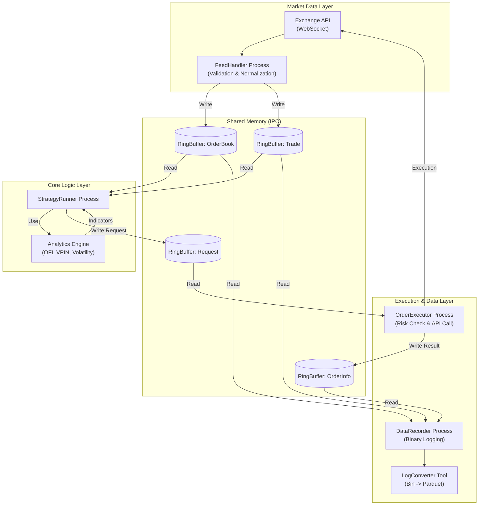

# HftSystem: C++20 기반 초저지연 알고리즘 트레이딩 엔진
#### (Institutional-Grade Low-Latency Trading System with Shared Memory IPC)

## I. 프로젝트 개요 (Overview)
본 프로젝트는 **Boost.Interprocess**를 활용한 **Zero-Copy Shared Memory** 아키텍처를 기반으로, 마이크로초($\mu s$) 단위의 지연 시간(Latency)을 목표로 하는 **C++20 고빈도 매매(HFT) 엔진**입니다.

기존의 모놀리식 구조에서 탈피하여 **수집(Feed) - 분석(Analytics) - 전략(Strategy) - 실행(Execution)**을 완벽하게 격리된 프로세스로 분리하였으며, 이를 통해 **장애 격리(Fault Isolation)**와 **무중단 운영**을 실현했습니다.

## II. 시스템 아키텍처 (System Architecture)
HftSystem은 **역할이 명확하게 분리된 다중 프로세스(Multi-Process)**가 **공유 메모리(Shared Memory)**를 통해 데이터를 전달하는 파이프라인 구조를 채택했습니다. 특히 v7.0부터는 **실시간 분석(Analytics)**과 **실행(Execution)** 계층을 물리적으로 격리하여 안정성을 강화했습니다.



- **FeedHandler**: 거래소 시세를 수신하여 검증(Validation) 및 정규화 후 SHM에 쓰는 **유일한 생산자(Producer)**입니다.
- **Analytics Engine**: 시장 미세구조(Market Microstructure) 지표인 OFI, VPIN, Volatility 등을 계산하는 독립 라이브러리입니다. 전략 프로세스 내에서 실행되며 공유 메모리의 Raw Data를 실시간으로 가공합니다.
- **StrategyRunner**: 오직 SHM 데이터만 읽고 판단하여 주문 요청을 생성합니다. 네트워크 I/O가 전혀 없어 판단 속도가 극대화됩니다.
- **OrderExecutor**: 기존 엔진 내부 모듈에서 **독립 프로세스**로 분리되었습니다. 전략의 상태와 무관하게 독자적으로 리스크를 관리(Pre-trade Check)하고 주문을 집행하며, 다중 거래소(Multi-Exchange)를 지원합니다.
- **DataRecorder**: 모든 틱 데이터를 손실 없이 **LZ4 압축 바이너리**로 저장합니다.

## III. 핵심 설계 결정 (Key Design Decisions)

### A. 극한의 성능 최적화 (Extreme Performance)
- **Lock-free RingBuffer**: `std::mutex` 대신 `std::atomic`과 `_mm_pause()`(Spinlock)를 사용하여 컨텍스트 스위칭 비용을 제거했습니다. (Avg IPC Latency: ~40ns).
- **Zero-Copy IPC**: 프로세스 간 데이터 전달 시 직렬화/역직렬화 비용이 없는 Raw Memory Copy 방식을 사용합니다.
- **CPU Pinning**: 주요 스레드(Feed, Strategy, Executor)를 특정 코어에 고정(Affinity)하여 L1/L2 캐시 적중률을 극대화하고 Jitter를 방지했습니다.

### B. 데이터 무결성을 위한 타입 시스템 (Strong Typing for Data Integrity)
- **목적**: 금융 연산에서 `double` 사용 시 발생하는 부동소수점 오차를 원천 차단합니다.
- **구현**: **`FinancialDecimal`** 클래스를 통해 256비트 정수(`int256_t`) 기반의 고정소수점 연산을 수행합니다. 또한, `Price`, `Quantity`, `Amount`를 서로 다른 타입으로 정의하는 **Strong Typing**을 적용하여, 가격과 수량을 더하는 등의 논리적 오류를 컴파일 타임에 방지합니다.

### C. 분석 엔진의 모듈화 (Modular Analytics Engine)
- **목적**: 전략 로직과 시장 분석 로직의 결합도를 낮추고, 다양한 지표를 레고 블록처럼 조합하여 사용합니다.
- **구현**: `OFI`, `VPIN`, `FlowMetrics` 등의 지표를 `analytics` 라이브러리로 분리했습니다. 각 지표는 런타임에 파라미터(Window Size, Decay Factor) 튜닝이 가능하며, 전략은 필요한 지표만 선택적으로 활성화하여 CPU 자원을 최적화합니다.

### D. 확장성 및 유연성 (Scalability)
- **Interface-based Design**: `IExchangeGateway`, `IStrategy` 인터페이스를 통해 거래소와 전략을 플러그인처럼 쉽게 추가할 수 있습니다.
- **Factory Pattern**: `GatewayFactory`, `StrategyFactory`를 통해 설정 파일(JSON)만으로 런타임에 동적으로 객체를 생성하고 조립합니다.

## IV. 디렉터리 구조 (Directory Structure)
```text
hftsystem/
├── analytics/          # [NEW] 시장 분석 지표 엔진 (OFI, VPIN 등)
├── api/                # 거래소별 REST/WS 클라이언트 구현체
├── common/             # 전역 공통 타입 (FinancialDecimal, RingBuffer)
├── config/             # 시스템 및 전략 설정 (JSON)
├── data_store/         # Shared Memory 관리자 및 Reader/Writer
├── factories/          # 객체 생성 팩토리 (Strategy, Client)
├── gateways/           # 거래소 연결 및 데이터 정규화 (Snapshotter 포함)
├── interfaces/         # 최상위 추상 인터페이스
├── managers/           # 핵심 매니저 (Risk, Trade, Order, Account)
├── processes/          # 실행 프로세스 (Main Entry Points)
│   ├── data_feed/      # 시세 수집기
│   ├── order_executor/ # 주문 실행기
│   ├── data_recorder/  # 데이터 기록기
│   └── strategy_runner/# 전략 실행기
├── strategies/         # 매매 전략 구현체 (Grid, Arbitrage)
├── tools/              # [NEW] 유틸리티 (LogConverter, MarketSnapshot)
└── utils/              # 로거, 시간, JSON 파싱 유틸리티
```

## V. 데이터 파이프라인 (Data Pipeline)
본 시스템은 실시간 트레이딩뿐만 아니라, 정밀한 사후 분석을 위한 데이터 파이프라인을 갖추고 있습니다.

1.  **실시간 기록 (Recording)**: `DataRecorder`가 공유 메모리의 모든 틱(Tick) 데이터를 손실 없이 압축(`LZ4`)하여 바이너리 파일로 저장합니다. (Multiplexed Format).
2.  **데이터 변환 (Conversion)**: `LogConverter` 툴을 사용하여 바이너리 로그를 **Apache Parquet** 포맷으로 변환합니다. 이는 Python(Pandas) 및 대용량 분석 도구와의 호환성을 보장합니다.
3.  **스냅샷 모니터링**: `market_data_logger` 툴을 통해 다중 거래소의 호가 스프레드를 1초 단위 CSV로 실시간 기록하여 차익거래 기회를 모니터링합니다.

## VI. 주요 성과 및 품질 보증 (Achievements)
- **Financial Data Accuracy**: 256비트 정수 연산을 통해 모든 거래 및 자산 계산의 무결성을 보장합니다.
- **Resilience**: WebSocket 연결 유실 시 `Snapshotter` 스레드가 자동으로 REST API를 통해 오더북 정합성을 복구합니다.
- **Latency**: 내부 벤치마크 결과, IPC 구간에서 평균 40ns 내외의 지연 시간을 달성했습니다.
